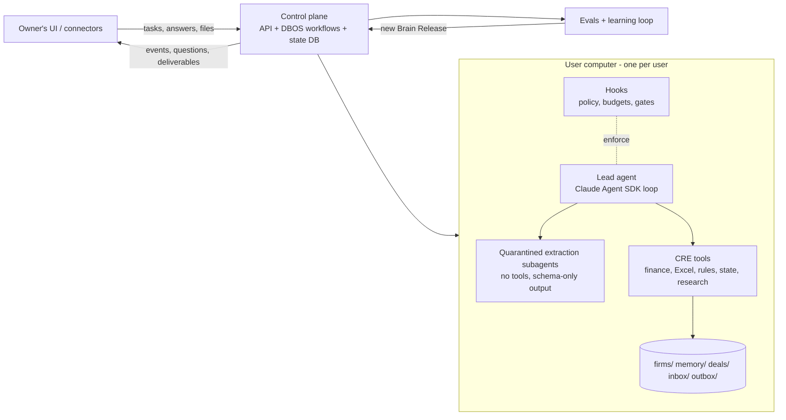

# METHOD: the autonomous CRE acquisition analyst

> **The product is an autonomous commercial real estate acquisition analyst: the Devin of real estate.**
> Devin plays two separate roles here:
> 1. It is the *inspiration* for the capability level we are aiming at.
> 2. It is the *coding agent that builds this repository*.
>
> The product itself contains no Devin and no software-engineering functionality.

This document records the decided method. Engineering detail lives in [docs/SPEC.md](docs/SPEC.md), the learning loop in [docs/LEARNING.md](docs/LEARNING.md), evaluation in [docs/EVALS.md](docs/EVALS.md), and the build plan in [feature_list.json](feature_list.json) and [docs/tasks/](docs/tasks/). Every decision here is final for v1 unless the owner changes it.

---

## 1. What we are building

An agent that does the job of a CRE acquisition analyst autonomously, the way Devin does the job of a software engineer.

| Devin (software) | This product (CRE acquisitions) |
|---|---|
| Takes a ticket in plain language | Takes any analyst request in plain language: "screen this deal", "full underwriting and IC memo", "abstract these leases", "compare these three deals", "draft an LOI at a 6.5% cap" |
| Has its own computer: shell, editor, browser | Has its own computer **per user**: shell, Python, Excel engine, browser, files |
| Plans, writes code, runs tests, fixes, and ships a PR | Plans, extracts, underwrites, verifies through gates, revises, and ships deliverables |
| Asks questions in Slack and keeps working | Asks questions and keeps working on stated default assumptions, then revises automatically when the answer arrives |
| Learns an org's codebase and conventions | Learns each **firm's** Excel template, buy-box, memo style and conventions |
| Improves from feedback | Improves from corrections and from an automated self-improvement loop (Section 6) |
| You can watch it work | Streams events so the UI can show live progress and replay a session |

**Scope of this repo:** the brain. That means the agent, its tools and skills, its gates, memory, evals and the learning loop. The owner's team builds the UI, the connectors (email, data rooms, CoStar and similar) and the infrastructure, including one computer box per user. This repo defines clean interfaces for all of those and ships stub implementations.

**v1 scope:** multifamily acquisitions. Other asset classes come later as separate releases, each with its own evals.

## 2. What "training the brain" means

We do not train model weights. The brain is a set of versioned artifacts:
- skills (`SKILL.md`)
- prompts
- playbooks
- decision tables
- tool code

These artifacts are improved automatically against a protected evaluation suite. The mapping to ordinary model training:

| Model training | This brain |
|---|---|
| Weights | `brain/` (skills, prompts, global playbook) and the firm playbooks |
| Loss function | `evals/`: frozen, protected, and anchored in real public data |
| Optimizer | Karpathy-style autoresearch keep/revert loop, with GEPA proposing edits |
| Checkpoint | A Brain Release: a manifest hash over the artifacts and model IDs |
| Fine-tuning data | User corrections, captured as structured decision records (DAgger) |

## 3. Architecture

### 3.1 Agent core: the Claude Agent SDK
The agent runs on the **Claude Agent SDK**, the same agent loop that powers Claude Code. It is the strongest proven autonomous loop available, and it gives us:
- a real computer: files, bash and web
- planning, subagents and automatic context compaction
- Skills
- **hooks that can block actions in code**
- sessions with resume

Building a loop ourselves would take longer and would be weaker.

**Portability.** Everything that makes the agent good at CRE is plain files or Python and does not depend on the SDK: skills, tools, finance code, rules, gates, memory and evals. The SDK sits behind a `Runner` interface. An OpenAI Agents SDK runner is added in M6, and the two runners compete on the same evals. v1 runs Claude models only.

**Rejected options:**
- Writing our own loop on Pydantic AI or LangGraph: it would be weaker.
- ii-agent as the runtime: it brings a large codebase, its bundled office skills are licence-encumbered, and its UI duplicates the owner's.
- LiteLLM: supply-chain incident in 2026.

### 3.2 One computer per user
- Each user has a persistent, isolated computer. The owner's infrastructure provides it; we define the image contract in SPEC §3.
- The agent process runs **inside** that computer, so its file, bash and browser tools act on that user's workspace directly.
- Users are fully isolated from one another: separate boxes, storage, credentials and memory.
- For development and CI we ship a local Docker implementation of the same `SandboxProvider` interface.

### 3.3 How a task runs
1. **Intake.** A request and any files arrive through the control-plane API. A durable DBOS workflow starts, so the task resumes if anything crashes.
2. **Plan.** The lead agent writes `todo.md` and picks the deliverables the request needs from the catalog.
3. **Screen first.** Fast classification and headline extraction run, then the buy-box check. A screen result streams to the user within minutes.
4. **Parallel extraction.** Quarantined subagents read the seller documents. They have no tools and schema-only JSON output, and return typed facts with page and cell provenance. The lead agent never reads raw seller text, which defends against prompt injection.
5. **Work.** The lead agent calls the CRE tools: deterministic finance, the Excel build and recalc, rules, state and research. **The LLM never does arithmetic.**
6. **Ask and continue.** When information is missing or ambiguous, the agent calls `ask_user`, records a default assumption, and keeps going. When the answer arrives, the dependency graph marks affected outputs stale and they are recomputed.
7. **Gates.** A deliverable can only be finalized when its gates pass (Section 4). Hooks enforce this in code.
8. **Deliver.** Outputs go to `deals/<id>/deliverables/`, with events streamed to the UI. When the agent cannot finish, the escalation is itself a deliverable (`BLOCKED` or `CONDITIONAL`, with the open questions and the defaults used).

### 3.4 Deliverable catalog
Users ask for any combination of:
- screen memo + go/no-go
- **full underwriting**: a Python model plus a live-formula Excel model in the firm's template
- IC memo
- due-diligence tracker + issues log
- LOI draft
- broker question and request list
- lease abstracts
- deal comparison

The agent decides which ones a request needs.

### 3.5 Firm adaptation
Firm onboarding ingests the firm's:
- Excel template, mapped cell by cell to our calculation IDs and verified by parity
- buy-box and policy, converted to ZEN decision tables
- memo samples, turned into a style guide
- conventions

Together these form the **firm playbook**. The agent always works in the firm's format.

### 3.6 Actions and connectors
- **Every capability is built.** Every external action is a **per-user toggle that defaults to OFF**: browsing, licensed data logins, emailing brokers, sending LOIs.
- With a toggle off, the agent drafts into `outbox/` instead of sending.
- Connectors are interfaces with stub implementations in v1: `EmailConnector`, `DataRoomConnector`, `MarketDataProvider`, `DocumentStore` and `Notifier`. The owner implements the real ones later.
- Licensed sources are welcome (CoStar, Yardi Matrix, Trepp, Reducto, Microsoft Graph Excel). All of them sit behind these interfaces.

### 3.7 Models (by role, set in `config/models.yaml`)
| Role | Default | Why |
|---|---|---|
| Lead agent | `claude-opus-5-5` | Judgment and long-horizon reliability |
| Extraction subagents | `claude-sonnet-5-5` | High volume, so cost and speed matter; checksums enforce accuracy |
| Fast decisions (document type, routing, red-flag triage) | Jev (`typesafe-sdk`), with `claude-haiku-4-5` as fallback | Sub-second typed decisions; Jev is used only after it is calibrated on our labelled cases |
| Verifier | A non-Claude flagship (OpenAI or Google) if its key exists, otherwise a separately prompted Claude instance | A different model family produces less correlated errors |
| Learning reflection | `claude-opus-5-5` | Runs offline, so quality matters more than cost |
| Arithmetic, rules, Excel | **No LLM** (Python, ZEN, LibreOffice or Excel) | LLMs make numeric errors |

### 3.8 Speed
"As fast as possible" in practice means:
- the screen streams first
- extraction fans out across subagents
- document parses are cached
- independent deliverables run in parallel
- fast models handle bulk work

Every deliverable has a latency budget, and latency is tracked as an eval metric.

## 4. Verification: the analyst's equivalent of tests

| Gate | Applies to | Check |
|---|---|---|
| Coverage | Extraction | Expected fields vs. found vs. missing; the missing-data policy lives in the rules |
| Checksums | Extraction | Rent roll ↔ GPR, with typed tolerances for loss-to-lease, model units and concessions; T-12 months sum to the annual total; unit counts tie |
| Parity | Underwriting model | Python ↔ Excel, cell by cell after recalculation (LibreOffice; real Excel through Graph when licensed); no `#REF!` or `#DIV/0!` |
| Ranges | Assumptions | Each assumption sits inside the ZEN range for its market tier and vintage; stale sources are flagged; public proxies are labelled |
| Fragility | Recommendations | Joint downside scenarios; if go/no-go flips inside plausible ranges, the recommendation is `CONDITIONAL` and the agent asks |
| IRR sanity | Returns | Multiple or undefined IRRs are reported explicitly, never hidden |
| Provenance + entailment | Memo, LOI | Every number maps to a fact or calc ID, and the cited source supports the claim |
| Policy bands | LOI | Price and terms fall inside the firm's policy tables |
| Verifier | Memo, LOI | A different model reviews against a rubric and coverage list, with at most 2 revise loops |

## 5. State, memory and knowledge
- **Canonical state.** A versioned store holding:
  - facts, each with a claim type, `valid_time`, `known_at` and provenance; claim types are seller assertion, verified fact, interpretation, approved policy, or conflict
  - assumptions, calculations, questions and deliverables, linked in a **dependency graph**
- **Invalidation.** New evidence or an answered question marks downstream items stale, and they are regenerated. An old memo never ships next to a new model.
- **Memory has three layers:**
  - **global brain:** skills, shared playbook, tools; seen by all users
  - **firm playbook:** private to the firm
  - **user memory:** corrections, preferences, past deals; private to the user
- **Global and private learning.** A lesson moves from private to global only after the **sanitization gate** (an entity and number scrubber) and the learning keep rule. One firm's deal data never reaches another firm.

## 6. How the brain improves itself (summary of [LEARNING.md](docs/LEARNING.md))
1. **Autoresearch loop**, following Karpathy's pattern:
   - The loop edits only `brain/`. `evals/` and the gates are frozen and protected.
   - It optimizes **one deliverable type at a time against frozen fixtures**.
   - GEPA proposes edits from failure categories.
   - Every experiment is logged in `results.tsv`.
2. **Keep rule.** All of the following must hold:
   - paired runs (k=3) with a bootstrap 95% CI lower bound above 0
   - a confirmation run on the holdout
   - no regression on counter-metrics (false flags, question rate, cost, latency)
   - a per-night multiple-comparison correction
3. **ACE playbook queue.** Live runs only *propose* lessons; promotion goes through the keep rule after sanitization.
4. **DAgger corrections.** Every user correction is saved as a structured decision record. It becomes a private eval case, and a sanitized global lesson when it generalizes.
5. **Releases.** Each accepted change produces a new Brain Release with rollback. A weekly end-to-end non-inferiority run guards against slow regressions.

## 7. Evaluation (summary of [EVALS.md](docs/EVALS.md))
We have no owner deals yet, so v1 evals use:
- **real public anchors:** CMBS Annex A-1, A-3 and EX-102 gold pairs (real numbers, narrative and outcomes), 8-K Rule 3-14 operating statements, Cook County valuation data, FRED, ACS, HUD and BLS
- **synthetic deals** with about 30 planted defect types plus clean controls
- an adversarial set
- a task-request suite
- a question-handling suite

**North star: Clean Autonomous Task Rate.** A task counts when it is completed with zero critical errors, an appropriate question rate, and deliverables accepted without material edits.

**Autonomy is earned per deliverable type** by meeting its bars on sealed sets. Shadow runs on real deals are added once they arrive.

**Honest limit:** public and synthetic data make the machine work. Expertise comes from real deals and corrections, which are added through `inbox/` and the correction API.

## 8. Build plan
Each milestone is delivered as one PR. Task detail is in [docs/tasks/](docs/tasks/) and [feature_list.json](feature_list.json).

| Milestone | Delivers |
|---|---|
| M0 | Scaffold, CI guards, config, release manifest |
| M1 | Domain schemas, state + invalidation, finance library, Excel mirror + recalc + parity, rules |
| M2 | Public data clients, CMBS gold pairs, synthetic generator + defects, adversarial, task and question suites, eval harness, judges |
| M3 | Agent SDK spike, user computer, CRE tools, hooks, extraction, decision model, gates, deliverables, lead-agent orchestration, control plane, end-to-end smoke |
| M4 | Firm onboarding, memory layers, sanitization |
| M5 | Autoresearch runner, GEPA, keep rule, ACE queue, DAgger corrections, releases + nightly runs |
| M6 | Connectors + toggles, inbox, OpenAI runner, baseline report + runbook |
