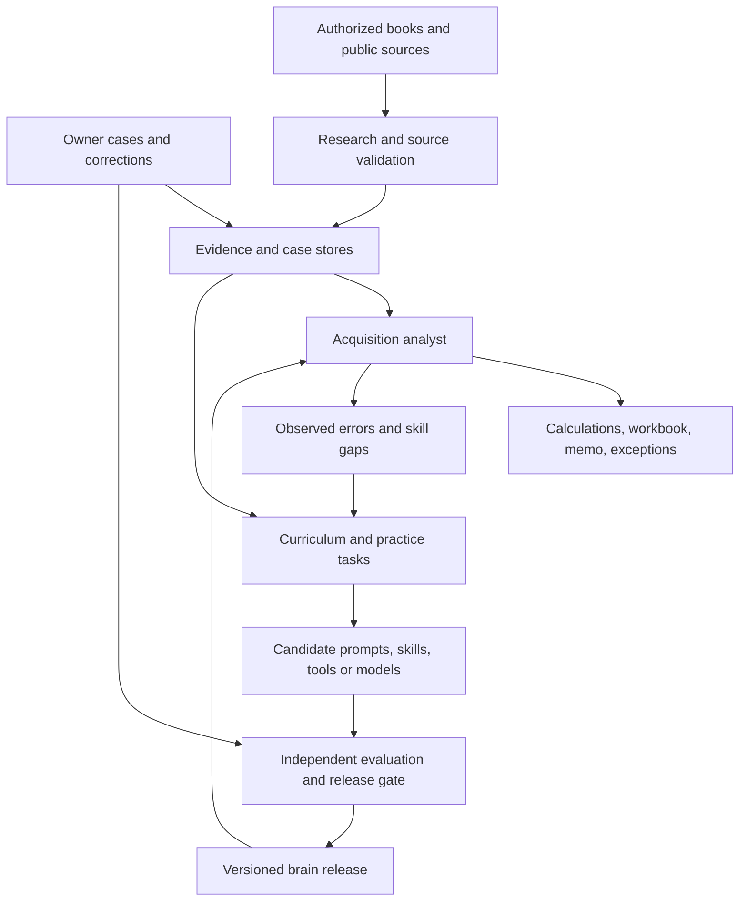

# Method: build an autonomous CRE acquisition analyst that learns

**Status:** evolving implementation and research plan, revised October 3, 2026.
**Owner:** the user, a CRE analyst and the system's domain teacher.
**Research:** [primary sources, books, evidence limits, and proposed experiments](docs/RESEARCH_BASIS.md). References such as R1 and B1 below refer to that document.
**Implementation status:** this repository currently contains the plan and research documentation. The acquisition runtime, automated improvement loop, and model-training pipeline are not implemented yet.
**Platform decision:** ii-agent is a candidate under evaluation; see the [platform assessment and adoption criteria](docs/PLATFORM_DECISION.md).

## 1. Goal and working assumptions

Build an AI acquisition analyst that can independently carry a supported deal from intake through screening, underwriting, diligence, investment recommendation, IC memo, proposed LOI, and deal-file QA. Start with multifamily; expand asset classes and strategies as competence is demonstrated. It should also identify its own knowledge gaps, study authorized sources, practice, learn from feedback, and improve its capabilities.

This document is the overall route to that endpoint. Early supervised stages are ways to build and evaluate competence. Update methods when experiments reveal a better approach; preserve the ambition while making progress measurable.

| Topic | Current position |
|---|---|
| Expert teaching | The owner has meaningful time and expertise to teach, review, demonstrate, and correct. There is no assumed ten-hour weekly ceiling. |
| Data | Use owner-supplied cases, authorized public sources, licensed references, generated practice cases, and accumulated operational experience. Public sources should supply a substantial part of the curriculum and background knowledge. |
| Autonomy | Full analyst execution within a stated investment mandate is the target. Autonomous learning is a separate capability that also develops over time. |
| Technology | Python, a provider-portable agent interface, deterministic finance tools, and an editable Excel model cross-checked against Python. |
| Model learning | Begin with knowledge, memory, prompts, skills, and tools. Permit later supervised fine-tuning or reinforcement learning if verified data and measured benefit justify it. |
| Product boundary | Build the brain and its learning infrastructure. UI and external integrations connect to explicit input/output and authority contracts. |
| Roadmap | Use capability milestones and measured dependencies; do not promise autonomy on a fixed calendar before the system exists. |
| Novelty | “First fully autonomous acquisition analyst” is an ambition. Establish a separate prior-art and product review before making a public first-of-kind claim. |

Define autonomy in operational terms: the agent chooses and executes the next permitted analytical step, researches missing information, uses tools, verifies results, and delivers a defensible result without routine step-by-step human instruction. An explicitly identified missing inspection, legal determination, private document, or investment-committee decision remains a dependency. It must not invent evidence to appear autonomous.

Define distinct authority to **analyze, recommend, draft, approve, communicate, and transact**. The analytical endpoint does not inherently require authority to sign an LOI, commit capital, or contact third parties. External actions require a configured mandate and integrations; analysis should not stall on ordinary internal tool use.

## 2. What “training itself” means

Treat these as separate learning processes with separate artifacts and checks:

| Process | What changes | How learning happens | Evidence required |
|---|---|---|---|
| Knowledge acquisition | Source library, claims, current facts, retrieval index | Read books, guides, filings, research, and public records; resolve and refresh claims | Source authority, scope, time, evidence linkage, permitted use |
| Case learning | Reviewed examples, corrections, decision records | Attempt tasks; compare with the owner's analysis and independent checks | Observed error, correction, relevant context, reason it generalizes |
| Procedural learning | Prompts, skills, playbook, retrieval/routing settings | Propose and evaluate bounded changes; retain effective procedures | Improvement on selection data and separate release evaluation |
| Tool learning | Candidate extraction or analysis code | Implement and test tools in an isolated experiment | Independent specifications, meaningful tests, compatibility and release checks |
| Weight learning, optional | Trainable model weights or adapters | Supervised fine-tuning on verified examples; later RL where rewards are defensible | Dataset provenance, model support, train/test separation, useful gain over simpler approaches |

Reading a book into a retrieval index does not update model weights. Editing a skill can change system behavior substantially without updating those weights. A normal API request cannot rewrite the parameters of a hosted frontier model. Weight training requires a provider-supported training route or a model we can train ourselves.

Our initial learning strategy is external and inspectable. Voyager, GEPA, and ACE support different parts of this approach (R3–R5). STaR and Self-Instruct provide precedents for a later weight-learning track (R9–R10). Do not rule out fine-tuning forever, and do not assume that fine-tuning is necessary to begin learning.

## 3. Architecture: acquisition work and learning work

Build two connected systems with separate permissions and state.



**Acquisition system:** one accountable orchestrator manages the deal workflow, retrieves evidence, invokes typed tools, and produces outputs. Bounded workers may process independent documents or research tasks where measurement justifies parallelism. Workers return evidence and structured results; they do not silently change shared deal state or policy.

**Learning system:** a research collector, curriculum scheduler, practice environment, experiment runner, evaluator, and release registry. These are logical responsibilities; they do not each require a separate model or service. Start with simple jobs and explicit interfaces.

Keep four forms of memory distinct, informed by the broader learning and cognitive-architecture literature (B1–B2):

- **Knowledge:** general concepts, dated facts, source-linked claims, and approved policy.
- **Case memory:** particular deals, attempted actions, results, corrections, and eventual outcomes.
- **Procedural memory:** reusable skills and tested tools, with preconditions and failure cases.
- **Active deal state:** the evidence, assumptions, decisions, and unfinished work for one current transaction.

Promote experience into reusable knowledge only after checking its scope. “This property received a tax concession” must not become “all acquisitions receive this concession.”

## 4. An autonomous research and knowledge pipeline

The system should research because a task or competency needs evidence, not because more scraped pages are automatically valuable. MineDojo and Co-Scientist offer complementary precedents for knowledge collection tied to practice and hypothesis testing (R1, R11).

### Source classes

| Source | Primary use | Boundary |
|---|---|---|
| Owner's methods, workbook, cases, and corrections | Investment mandate, domain conventions, decision examples | Distinguish personal/institutional policy from general facts; identify uncertainty and exceptions |
| Authorized textbooks and professional references | Durable concepts, worked examples, curriculum | Preserve edition and page references; books can be outdated or disagree |
| Fannie Mae/Freddie Mac guides and other primary requirements | Financing criteria and underwriting definitions | Apply to the relevant program, effective date, and loan type; not universal investor policy |
| Government data, local records, filings, and original research | Market context, property facts, historical evidence | Verify units, reporting periods, population, jurisdiction, and revisions |
| Seller packages and broker reports | Deal-specific assertions and market perspectives | Interested-party claims need reconciliation and corroboration |
| Practitioner articles, presentations, forums, and videos | Discovery, hypotheses, examples, vocabulary | Do not promote popularity or repetition into authority |
| Generated content | Exercises, counterexamples, candidate lessons | Never treat it as independent corroboration of its own source |

Start discovery from the verified portals in the research companion. Validate additional sources as markets and tasks are selected. The first corpus should be curated and expandable; the agent may discover further sources under documented acquisition and quality rules.

### Collection and promotion procedure

1. Identify a knowledge gap from a live task, failed exercise, changed market condition, or scheduled review.
2. Form a research question and identify the strongest available primary sources. Search with public descriptions; do not disclose private deal contents through public queries.
3. Acquire authorized material with suitable rate limits. Record rights separately for storage, retrieval, generated examples, and model training; public readability does not automatically authorize every reuse. Do not bypass paywalls or access restrictions.
4. Store source identity, publisher/author, URL or document locator, edition/version, publication/effective dates, retrieval time, content hash, permitted use, jurisdiction, and source family. Retain bounded excerpts or full content according to permitted use.
5. Extract claims with exact evidence locations, units, scope, limitations, and contradictions. Deduplicate both text and originating sources; copied articles are not independent corroboration.
6. Classify each claim as a source assertion, verified fact, interpretation, hypothesis, approved policy, or unresolved conflict. Keep conflicting claims visible. Prefer authority appropriate to the question rather than a universal source ranking.
7. Turn promising material into candidate knowledge cards, exercises, or policy proposals. A public source can update a dated fact through an approved rule; it cannot silently alter the owner's return hurdle or risk mandate.
8. Test promoted lessons against relevant real or controlled cases. Publish accepted knowledge with its evidence, and schedule refresh or expiry for changing facts.

Each knowledge card needs: `claim`, `source_ids`, `evidence_locations`, `scope`, `valid_time`, `known_at`, `status`, `conflicts`, `examples`, and `related_skills`. A generated summary must remain traceable to its originals.

Public material can teach concepts and supply substantial practice. It cannot reveal an unavailable lease amendment, an unperformed physical inspection, or the correct private assumptions for a particular buyer. The research process should identify such gaps precisely and continue independent work.

## 5. Curriculum and the owner's teaching role

Build a competency graph with prerequisites, supported task types, evidence of mastery, known failures, and last evaluation date. Start with:

1. Document literacy: OMs, rent rolls, T-12s, leases, amendments, operating statements, and loan terms.
2. Financial conventions: periods, units, accrual/cash distinctions, normalized NOI, concessions, bad debt, reserves, and capex.
3. Underwriting: debt sizing, amortization, taxes, insurance, renovation, exit values, returns, and price constraints.
4. Evidence judgment: conflicting documents, source authority, missing information, and materiality.
5. Investment judgment: comparable selection, defensible assumptions, correlated downside cases, and recommendation under uncertainty.
6. Diligence: lease exceptions and issue investigation across the supported legal, physical, environmental, and market document classes.
7. Communication: an auditable IC memo, proposed LOI, exceptions, and complete deal-file handoff.
8. Long-running execution: revised documents, changing facts, resumption, and downstream invalidation.

The scheduler selects the next task using failure frequency, business consequence, uncertainty, expected learning value, prerequisite coverage, and available budget. Mix remediation with previously mastered tasks to detect forgetting. Avoid a curriculum that repeatedly chooses easy wins.

The owner supplies worked examples, reviews disputed interpretations, defines policy, and corrects agent attempts. Capture a **structured decision record**: evidence available, chosen action, calculation or cited justification, acceptable alternatives, missing information, and the correction. No hidden model reasoning is required.

Use a DAgger-inspired cycle (R8): run the learner, inspect the states and mistakes it actually reaches, obtain expert corrections, and add those to development data. Ask high-value questions in batches. Also sample apparently confident successes to find undetected errors. Significant available expert time accelerates this process; the system should nevertheless learn to need less routine instruction.

Expert agreement is not universal truth. Record whether a label is a factual correction, a financial convention, the owner's preference, or a defensible judgment range. Preserve alternative acceptable conclusions and the assumptions that make them valid.

## 6. A practice environment for acquisition analysis

Create practice from three complementary sources:

- **Real case replay:** owner-supplied packets and authorized public examples, with reviewed evidence and expected outcomes.
- **Controlled synthetic cases:** a structured underlying property, leases, cash flows, financing, and events; derive answers before rendering documents. Include missing, contradictory, and misleading observations.
- **Counterfactual exercises:** vary an existing case's price, financing, rent, taxes, expense growth, capex, or document completeness while retaining explicit assumptions and recalculable outputs.

AlphaGeometry suggests the value of generated tasks with independently checkable answers (R6); Sutton and Barto explain why learning in a model must account for model error (B1). Our simulator is a training environment, not evidence that its market assumptions are true.

Define feedback by task:

| Task | Strongest available feedback |
|---|---|
| Financial arithmetic | Independent reference calculations, accounting identities, properties, and approved workbook cases |
| Extraction | Source-linked labels, coverage checks, and reviewed semantic accuracy |
| Policy execution | Versioned policy tests and explicit applicability rules |
| Assumptions and recommendations | Expert-reviewed defensible ranges, evidence completeness, prospective comparison, and eventual outcomes |
| Research and knowledge | Source entailment, authority, contradiction handling, freshness, and demonstrated downstream usefulness |
| Long-running workflow | Correct resumption, dependency invalidation, version consistency, and idempotency checks |

A model judge can assist with evaluation and triage. It cannot create independent ground truth by agreeing with another model. Measure judge errors against reviewed examples before using its decisions to gate autonomous updates.

Adversarial cases should include swapped unit identifiers with unchanged totals; wrong periods; omitted amendments; stale spreadsheet caches; circular or undefined return calculations; optimistic assumptions hidden in a seller model; unsupported citations; prompt injection; simultaneous market shocks; and newly received evidence that changes an earlier conclusion.

## 7. The automated improvement loop: Karpathy-style autoresearch

Automated improvement is a core planned capability, regardless of which agent runtime we choose. Adapt Andrej Karpathy's autoresearch pattern: the agent proposes a change, executes a bounded experiment, measures the result, keeps or rejects the candidate, and repeats. This loop is specified here but has not been built or run in this repository.

Karpathy-style autoresearch supplies the experiment lifecycle and recordkeeping (R14). GEPA is a candidate method for proposing and selecting prompt changes (R4). ACE is an optional method for evolving contextual memory (R5). These have different roles; installing ii-agent or loading a skill does not implement the learning loop. Compare the methods against simpler baselines before combining them.

```text
identify a material failure or knowledge gap
select a task family and bounded experiment budget
retrieve relevant source evidence and reviewed examples
propose one attributable change or a recorded candidate combination
run isolated practice and development checks
compare candidates on selection data, including errors, coverage and cost
reject invalid changes and preserve failed-experiment records
submit a selected candidate to the independent release gate
publish a versioned release if its current authority permits it
monitor prospective behavior; roll back on defined regressions
```

### What must be built for an unattended learning run

- A versioned learning charter, such as `program.md`, defining the task family, editable artifacts, objectives, protected surfaces, total budget, and stopping conditions. This is a planned artifact, not an existing configuration file.
- A scheduler that selects consequential skill gaps and launches experiments within an explicit time/cost/trial budget. Stop on exhausted budget, repeated infrastructure failures, invalid evaluation, or the defined lack-of-progress condition.
- An isolated candidate workspace and runner. Preserve the deployed baseline while testing prompts, skills, retrieval settings, tools, or an authorized training configuration.
- An experiment record containing the hypothesis, parent version, exact change, model/settings, data split identifiers, evaluator version, metrics, cost, and keep/reject reason. Preserve unsuccessful trials as well as successful ones.
- A selection process and a separate release gate, following section 8. Keeping a candidate for further experiments does not automatically authorize its deployment.
- A versioned release registry, prospective monitoring, and tested rollback. Gradually authorize automatic promotion for specified update classes.

**Completion demonstration:** starting from a recorded weakness, the loop must autonomously run multiple candidates, reject a deliberately worse candidate, retain a supported improvement, and reproduce its result. Separate release evaluation must confirm the improvement before promotion under the current authority policy. Generalization, regression checks, and rollback must work; a log showing that the agent edited files is insufficient.

### What may change

| Change class | Development behavior | Promotion policy |
|---|---|---|
| New source records and candidate lessons | Automatic collection and staging under source rules | Evidence and applicability checks; policy changes remain distinct |
| Prompts, retrieval settings, and approved skill surfaces | Autonomous bounded experiments | Independent evaluation and versioned release |
| Tools or workflow code | Candidate changes in an isolated branch/experiment workspace | Meaningful tests and controlled deployment; no live self-modification |
| Model weights/adapters | Optional training experiments on authorized verified data | Compare to baseline; separate compatibility, quality, and rollback checks |
| Investment policy, evaluator definitions, release thresholds, permissions, or budgets | Agent may propose changes with evidence | Owner-governed changes; the candidate cannot rewrite the criteria deciding its own success |

Protect release cases, scores, secrets, and evaluator implementation from unauthorized access by the candidate process; a “do not look” prompt is insufficient. Keep evaluator changes in a separate change history with their own validation. Freeze the deployed release during a deal run unless an explicit migration is recorded.

Start by approving releases with the owner. Advance to automatic promotion for specified change classes once the evaluator and rollback process have earned that authority. The eventual learning system should not require a human to approve every successful low-impact lesson or skill update.

### Optional weight-training track

When a verified corpus exists, compare supervised fine-tuning or distillation of a supported model against the retrieval/prompt/skill baseline. Train on observable task records and reviewed outputs with appropriate rights. Revalidate rare cases, general capabilities, calibration, and supported providers after each change.

Use RL only where actions and rewards can be specified and tested. A later realized investment return is affected by markets, financing, execution, and selection; it is not an immediate, unconfounded reward for every analytical choice. Do not start by pretraining a frontier model from scratch or by feeding arbitrary scraped text into repeated self-training (R9–R12).

## 8. Evaluation, data separation, and autonomy gates

Maintain separate purposes:

| Data partition | Allowed use |
|---|---|
| Development/training | Generate lessons, debug, fit candidate prompts or models |
| Selection validation | Compare candidates and decide what to submit for release |
| Restricted release evaluation | Assess selected releases under a controlled test-access policy |
| Prospective shadow/operational audit | Measure performance on subsequently arriving real tasks |

Partition by underlying deal and related source lineage, not document chunk. Account for shared properties, sponsors, templates, time periods, and generated-case ancestry. When release-test feedback is used for further development, record the exposure and eventually retire or replenish that test pool. Repeated automated releases require a managed stream of independent evaluation cases; hiding one fixed benchmark does not make it inexhaustible.

For historical cases, record both what a fact describes and when it became knowable. ALFRED and dated source snapshots can help. A pretrained model may already know an outcome, so date filtering and anonymization alone cannot prove that a retrospective test is uncontaminated. Use prospective cases as a separate check.

Evaluate **correctness and useful coverage separately**:

- Critical error and false-clearance rates, with severity and uncertainty intervals.
- Financial correctness, source entailment, missing-information detection, and justified abstention.
- False rejection and excessive escalation, judged against the mandate and available evidence.
- Calibration of uncertainty and sensitivity to correlated downside scenarios.
- Complete, useful deliverables; reviewer time and material corrections required.
- Total latency and cost, including research, extraction, retries, optimization, and evaluation.
- Transfer to new cases and retention of prior capabilities.

Define error tolerances and supported populations with the owner before release; do not optimize an undefined aggregate “autonomy score.” A correctly identified need for unavailable evidence should not be penalized as though it were a reasoning failure. Equally, count avoidable escalations so permanent dependence on the owner is visible.

Choose statistical comparisons at the deal level where appropriate. Repeated model runs measure stochastic variation but do not create new independent properties. With zero critical failures in 20 independent representative deals, the one-sided 95% binomial upper failure-rate bound is about 13.9%; 20 successes is a learning milestone, not universal proof of readiness.

Track two independent progressions:

| Analyst execution | Learning and release |
|---|---|
| Observe expert examples | Collect and propose lessons |
| Attempt tasks with review | Run bounded experiments automatically |
| Execute validated phases independently | Promote specified update classes after independent checks |
| Own the supported end-to-end analytical workflow | Maintain curriculum, evaluate, release, monitor, and roll back within policy |

A fully autonomous analyst release must pass the supported end-to-end workflow, including research, exceptions, revisions, and QA. Per-phase success alone is insufficient.

## 9. Acquisition workflow and state

The workflow follows transaction needs rather than forcing every deal through an inflexible sequence. Screening and an initial LOI can precede full diligence; new evidence may revisit price, assumptions, or the recommendation.

| Capability | Required output |
|---|---|
| Intake | Document inventory, property identity, versions, missing requirements |
| Extraction and reconciliation | Typed facts with evidence locations, dates, units, conflicts, and confidence/status |
| Screening | Supported pursue/pass/conditional recommendation and reasons |
| Underwriting | Explicit assumptions, Python calculations, live-formula Excel, scenario and price analysis |
| Research and diligence | Investigated issues, source-backed findings, unresolved dependencies, materiality |
| IC memo | Recommendation, alternatives, risks, evidence, financial derivations, and conditions |
| Proposed LOI | Price and terms consistent with approved policy and the current deal state |
| Deal-file QA | Completeness, consistency, provenance, version alignment, and handoff status |

Use a canonical versioned state store. JSON files can be exports or local views; they must not silently compete with the database as independent truth. Track source revisions, effective/known dates, facts, assumptions, approved overrides, derived calculations, decisions, and their dependency graph.

When a document or policy changes, mark affected descendants stale, recompute or request adjudication as required, and publish a consistent new set of outputs. An older memo cannot quietly accompany a revised workbook. Replays should use the original source, code, policy, and model configuration or clearly record differences.

A brain release manifest records model identifiers and settings, prompts, skill and code hashes, policy and schema versions, source-index snapshot, training/selection dataset versions, evaluator version, and release evidence. Preserve prior releases and rollback capability.

## 10. Financial and evidence controls

Keep arithmetic in tested tools. Specify sign, timing, day-count, rounding, leverage, reserves, exit, and cash-flow conventions. Treat multiple or undefined IRRs explicitly; do not conceal them behind a single default number. Independently validate the approved financial specification and representative examples.

Python/Excel parity is a useful consistency test, not a proof that the shared model is economically correct. Recalculate supported spreadsheets and test relevant template, formula, and engine changes. Preserve input/output provenance and surface unresolved material assumptions.

Distinguish seller assertions from accepted facts and analytical assumptions. Validate that citations entail the associated claim. Retain source spans so an isolated evidence-review tool can investigate novel clauses or contradictions without giving document contents policy-changing authority.

Untrusted documents and websites may contain instructions or malicious content. Treat them as evidence, constrain document-processing permissions, sandbox generated code and appropriate parsers, and validate tool outputs. Schema-valid JSON can still contain wrong facts or hostile text.

Test downside scenarios jointly where economic drivers interact; one-variable sensitivity alone is insufficient. Distinguish a modest change in valuation from a breached policy constraint or a fragile go/no-go recommendation. Represent maximum supportable price and conditional conclusions where those better express the decision.

## 11. Initial stack, with explicit reasons to change it

| Need | Starting choice | Reconsider when |
|---|---|---|
| Agent runtime and workbench | Evaluate ii-agent against the Python/Pydantic AI baseline; decision pending | Select on the platform trial below, maintenance burden, extension quality, and component licensing |
| Durable execution | Validate the chosen runtime's persistence and recovery; DBOS/Postgres remains a candidate if stronger workflow guarantees are needed | Add an engine only for a demonstrated gap; persisted chat history alone is insufficient evidence of deal-workflow recovery |
| Evidence storage | Versioned object storage plus structured metadata; add hybrid retrieval when corpus needs it | Measured retrieval failures justify a different index or representation |
| Extraction | Native XLSX/CSV parsing, Docling as a candidate PDF parser, evaluated vision fallback | Real-document tests identify a better pipeline |
| Finance and Excel | Tested Python functions/PyXIRR, openpyxl, LibreOffice recalculation, supported Excel validation | Required financial conventions or workbook compatibility demand alternatives |
| Policy | Versioned typed rules; ZEN where a visual editor helps the owner | Editing and audit requirements justify the added engine |
| Evaluation | One reproducible runner, such as Inspect AI, plus deterministic task checks | A demonstrated evaluation requirement is not met |
| Learning | Karpathy-style experiment lifecycle, curriculum scheduler, independent evaluator, experiment/release registry; GEPA candidate and incremental memory tested separately | Controlled comparisons favor another optimizer or memory method; ii-agent adoption does not remove this work |
| Classification | Typed model interface and simple baseline; benchmark Jev as a candidate | Target-distribution accuracy, calibration, price, and availability justify adoption |
| Isolation and observability | Restricted experiment execution; structured traces, optional OpenTelemetry/Langfuse | Workload and confidentiality requirements determine deployment |

Pin concrete versions and model identifiers during implementation. Measure each model's capability and cost on our tasks rather than treating a brand or generation as permanently best. Different model families may help challenge conclusions, but are not automatically independent evaluators.

Define deployment choices from actual workload and data policy. Self-hosting telemetry alone does not determine how model providers handle supplied data. Apply access, retention, and permitted-use rules to documents, traces, training examples, and model calls alike.

### ii-agent adoption decision

ii-agent could supply the teaching interface, research tools, model adapters, task execution, and session persistence. Keep financial calculations, evidence/deal schemas, policy, evaluation datasets, and learning releases behind our own portable interfaces. If selected, use ii-agent as the primary runtime; add Pydantic AI or another runtime only for a specific demonstrated need.

Before adopting it, run a representative packet through our tools, research a missing question with preserved evidence, produce inspectable outputs, capture an expert correction, evaluate a candidate improvement on a separate case, and verify interruption/revision handling. Also resolve or replace bundled components with restrictive licenses. The [platform decision record](docs/PLATFORM_DECISION.md) distinguishes inspected source capabilities from untested runtime behavior. This is an implementation choice within the overall method, not a change to the autonomous-learning objective.

## 12. Milestones to the complete system

Stages may overlap when their prerequisites are satisfied. Every stage needs an executable demonstration and documented evidence before its dependent capabilities are claimed.

| Milestone | Build | Evidence to advance |
|---|---|---|
| M0. Domain and authority contract | Supported deal class, investment mandate, reference workbook, initial curriculum, definitions of material error, source and action policy | The owner and system can distinguish facts, assumptions, preferences, and unknowns on representative examples |
| M1. Evidence and teaching foundations | Source registry, claim/case stores, demonstrations, correction capture, independent finance examples, initial evaluation partitions | A concept and a correction can be traced from source to exercise to evaluated behavior |
| M2. Complete baseline workflow | One supported deal from intake to workbook, recommendation, memo, proposed LOI, and QA with review | Real-packet run completes; errors and needed corrections are measured; document revisions propagate correctly |
| M3. Autonomous research and practice | Gap-driven collection, curriculum scheduling, controlled cases, replay, deterministic checks | Agent identifies a gap, finds legitimate evidence, creates valid practice, and improves performance on separate cases |
| M4. Automated improvement | Candidate experiments, protected evaluation, manifests, regression controls, rollback | Improvement beats a fixed baseline and expert-only revision under comparable budgets; release process rejects planted evaluator-gaming attempts |
| M5. Diligence and breadth | Additional document classes, complex assumptions, long-running investigation, uncertainty and exception handling | Supported difficult cases and correlated downside scenarios work end to end with bounded material error |
| M6. Autonomous analyst operation | Prospective execution within the mandate, defined action permissions, monitoring and rollback | End-to-end targets are met on independent prospective work; authority limits and required external dependencies are correctly handled |
| M7. Autonomous continuing learning | Policy-bounded source refresh, curriculum, experimentation, promotion, and drift response | Approved update classes improve the system without routine human release approval, while regression and rollback tests remain effective |
| M8. Expansion and optional specialized models | Other strategies/asset classes and, where justified, weight training | Each extension earns its own coverage and reliability evidence; shared capabilities retain performance |

Revisit architecture and sequencing after each milestone. Record what changed, the evidence, expected benefit, and how to reverse it. A failed experiment can eliminate an approach without changing the ultimate product goal.

## 13. First implementation experiments

1. **Source-to-skill:** choose one substantive underwriting concept, collect primary/reference material, reconcile it with the owner's convention, build exercises, and test transfer to a separate real case.
2. **Expert-to-skill:** let the agent attempt a task, capture the owner's correction, implement a candidate lesson, and measure whether the same error disappears without introducing new ones.
3. **Verified practice:** construct a deal state, render consistent and corrupted versions, and verify that finance and evidence checks distinguish them.
4. **Learning comparison:** compare fixed baseline, retrieval, expert revision, GEPA, and incremental memory with the same tasks and total budget. Test components separately before stacking them.
5. **Revision and autonomy:** introduce a new lease amendment or rent roll, require the agent to locate all affected outputs, update them, and explain the changed decision without step-by-step instruction.

Start these with enough cases to expose failure modes; choose subsequent sample sizes from error tolerances and the supported population. Finalize budget caps, markets, source licenses, and model access when needed for the relevant experiment. Do not invent fixed dataset counts, development weeks, or nightly training costs.

## 14. What this revision changes

- Makes autonomous acquisition analysis **and** autonomous learning explicit goals.
- Replaces the assumed expert-time shortage with an active teaching partnership.
- Adds internet research, source validation, curriculum, practice, and knowledge promotion as first-class systems.
- Separates knowledge/skill learning from optional weight training.
- Adopts published mechanisms with explicit transfer limits rather than treating framework names as proof.
- Separates candidate selection from release testing and manages repeated test exposure.
- Measures critical errors, justified uncertainty, useful coverage, and autonomy separately.
- Adds revision semantics, canonical state, protected evaluation, and graduated automatic releases.
- Keeps the full product destination while replacing the fixed calendar with evidence-based milestones.
