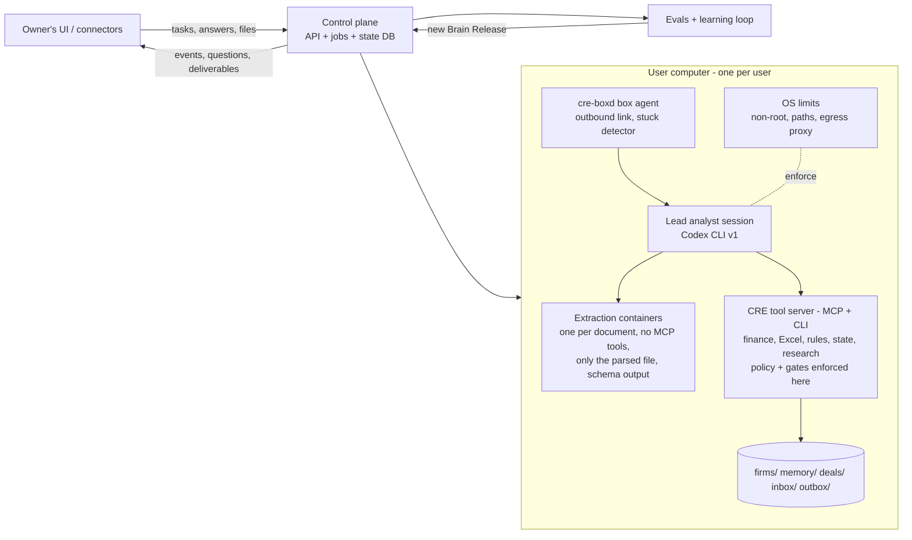

# METHOD: the autonomous CRE acquisition analyst

> **The product is an autonomous commercial real estate acquisition analyst: the Devin of real estate.**
> Devin plays two separate roles here:
> 1. It is the *inspiration* for the capability level we are aiming at.
> 2. It is the *coding agent that builds this repository*.
>
> The product itself contains no Devin and no software-engineering functionality.

This document records the decided method. Engineering detail lives in [docs/SPEC.md](docs/SPEC.md), the learning loop in [docs/LEARNING.md](docs/LEARNING.md), evaluation in [docs/EVALS.md](docs/EVALS.md), and the build plan in [feature_list.json](feature_list.json) and [docs/tasks/](docs/tasks/). Every decision here is final for v1 unless the owner changes it.

---

## 1. What we are building

An agent that does the job of a CRE acquisition analyst autonomously, the way Devin does the job of a software engineer.

| Devin (software) | This product (CRE acquisitions) |
|---|---|
| Takes a ticket in plain language | Takes any analyst request in plain language: "screen this deal", "full underwriting and IC memo", "abstract these leases", "compare these three deals", "draft an LOI at a 6.5% cap" |
| Has its own computer: shell, editor, browser | Has its own computer **per user**: shell, Python, Excel engine, browser, files |
| Plans, writes code, runs tests, fixes, and ships a PR | Plans, extracts, underwrites, verifies through gates, revises, and ships deliverables |
| Asks questions in Slack and keeps working | Asks questions and keeps working on stated default assumptions, then revises automatically when the answer arrives |
| Learns an org's codebase and conventions | Learns each **firm's** Excel template, buy-box, memo style and conventions |
| Improves from feedback | Improves from corrections and from an automated self-improvement loop (Section 6) |
| You can watch it work | Streams events so the UI can show live progress and replay a session |

**Scope of this repo:** the brain. That means the agent, its tools and skills, its gates, memory, evals and the learning loop. The owner's team builds the UI, the connectors (email, data rooms, CoStar and similar) and the infrastructure, including one computer box per user. This repo defines clean interfaces for all of those and ships stub implementations.

**v1 scope:** multifamily acquisitions. Other asset classes come later as separate releases, each with its own evals.

## 2. What "training the brain" means

We do not train model weights. The brain is a set of versioned artifacts:
- skills (`SKILL.md`)
- prompts
- playbooks
- decision tables
- tool code

These artifacts are improved automatically against a protected evaluation suite. The mapping to ordinary model training:

| Model training | This brain |
|---|---|
| Weights | `brain/` (skills, prompts, global playbook) and the firm playbooks |
| Loss function | `evals/`: frozen, protected, and anchored in real public data |
| Optimizer | Karpathy-style autoresearch keep/revert loop, with GEPA proposing edits |
| Checkpoint | A Brain Release: a manifest hash over the artifacts and model IDs |
| Fine-tuning data | User corrections, captured as structured decision records (DAgger) |

## 3. Architecture

### 3.1 Agent core: Codex CLI now, an SDK runner before commercial launch
**Development and training (now): the Codex CLI.**
- The analyst runs as headless Codex CLI sessions (`codex exec --json`) inside each user's computer.
- The Codex CLI is a full autonomous agent loop, with planning, shell and file tools, sandboxing, MCP tools, `AGENTS.md` and Agent Skills.
- It is already installed and authenticated on the build machine, so the brain is trained without separate model API keys.
- **Roles are separate:**
  - Devin *builds* the system.
  - Codex sessions *play the analyst*.
  - Scoring is a separate, blind step (Section 7).

**Before commercial launch (M8):** add the Claude Agent SDK and/or the OpenAI Agents/Codex SDK as runners. Re-run every eval on each runner and keep the best per deliverable.

**Portability:** everything that makes the agent good at CRE is runner-independent:
- skills, tools, finance code, rules, **gates (enforced inside the tool server, not the runner)**, memory and evals
- runners sit behind one `Runner` interface
- only small per-runner prompt overlays differ

**Borrowed patterns:** from OpenHands (MIT), re-implemented, not depended on:
- a typed event stream
- stuck detection
- interrupt, pause and mid-task messages
- confirm-before-act
- secret redaction
- an agent service inside the box
- stress tests

**Rejected options:**
- Writing our own loop on Pydantic AI or LangGraph: it would be weaker.
- ii-agent as the runtime: large codebase, licence-encumbered office skills, and its UI duplicates the owner's.
- Forking OpenHands: coding-agent focus, LiteLLM dependency, single-tenant server, heavy churn, enterprise licence.
- LiteLLM: supply-chain incident in 2026.

### 3.2 One computer per user
- Each user has a persistent, isolated computer. The owner's infrastructure provides it; we define the image contract in SPEC §3.
- The agent process runs **inside** that computer, so its file, bash and browser tools act on that user's workspace directly.
- Users are fully isolated from one another: separate boxes, storage, credentials and memory.
- For development and CI we ship a local Docker implementation of the same `SandboxProvider` interface.

### 3.3 How a task runs
1. **Intake.** A request and any files arrive through `cre run` (M2) or the control-plane API (M6). Raw files go to `/srv/raw`, outside the analyst's view. A jobs table with idempotent segments lets a crashed task resume without duplicate work.
2. **Plan.** The lead agent writes `todo.md` and picks the deliverables the request needs from the catalog.
3. **Screen first.** Fast classification and headline extraction run, then the buy-box check. A screen result streams to the user within minutes.
4. **Parallel extraction.**
   - Deterministic code pre-parses each document.
   - Each document is then read in its own **throwaway container** that holds only that parsed file, has no MCP tools and has restricted network, and must produce schema-only output.
   - Results become typed facts with page and cell provenance.
   - The lead analyst never sees raw seller text, which defends against prompt injection. Isolation comes from the container, because Codex always has a shell.
5. **Work.** The lead analyst calls the CRE tools: deterministic finance, the Excel build and recalc, rules, state and research. **Every number in a deliverable must trace to a stored calculation or fact.** A gate enforces this, so arithmetic done by the model in the shell cannot pass.
6. **Ask and continue.** When information is missing or ambiguous, the agent calls `ask_user`, records a default assumption, and keeps going. When the answer arrives, the dependency graph marks affected outputs stale and they are recomputed.
7. **Gates.** A deliverable can only be finalized when its gates pass (Section 4). The tool server enforces this in code, for every runner. OS limits and a stuck detector back it up.
8. **Deliver.** Outputs go to `deals/<id>/deliverables/`, with events streamed to the UI. When the agent cannot finish, the escalation is itself a deliverable (`BLOCKED` or `CONDITIONAL`, with the open questions and the defaults used).

### 3.4 Deliverable catalog
Users ask for any combination of:
- screen memo + go/no-go
- **full underwriting**: a Python model plus a live-formula Excel model in the firm's template
- IC memo
- due-diligence tracker + issues log
- LOI draft
- broker question and request list
- lease abstracts
- rent comp analysis (public proxies until licensed comps are connected)
- debt quote summary
- deal comparison (multi-deal tasks)

**The finance core also covers:**
- property-tax reassessment on sale
- value-add renovation and unit-turn schedules
- JV waterfall and promote
- refinance and hold-vs-sell scenarios
- rent-regulation checks

**Every deliverable is versioned.** When a user edits a deliverable (for example the Excel model) and uploads it back, the edit is ingested and turned into corrections.

The agent decides which ones a request needs.

### 3.5 Firm adaptation
Firm onboarding ingests the firm's:
- Excel template, mapped cell by cell to our calculation IDs and verified by parity
- buy-box and policy, converted to ZEN decision tables
- memo samples, turned into a style guide
- conventions

Together these form the **firm playbook**. The agent always works in the firm's format.

### 3.6 Actions and connectors
- **Every capability is built.** Every external action is a **per-user toggle: `off` (the default), `ask` (the user confirms each action), or `on`**. External actions are browsing, licensed data logins, emailing brokers and sending LOIs.
- **Users can steer mid-task:** interrupt, pause, resume, or send a new instruction while the agent works.
- With a toggle off, the agent drafts into `outbox/` instead of sending.
- Connectors are interfaces with stub implementations in v1: `EmailConnector`, `DataRoomConnector`, `MarketDataProvider`, `DocumentStore` and `Notifier`. The owner implements the real ones later.
- Licensed sources are welcome (CoStar, Yardi Matrix, Trepp, Reducto, Microsoft Graph Excel). All of them sit behind these interfaces.

### 3.7 Models (by role, set in `config/models.yaml`)
| Role | v1 (development/training) | Later (commercial) | Why |
|---|---|---|---|
| Lead analyst | Codex CLI session, profile `analyst` | Claude Agent SDK or OpenAI SDK, chosen by evals | Judgment and long-horizon reliability |
| Extraction | One-shot Codex session, profile `extractor` (read-only, no tools, output schema) | Same pattern on the chosen SDK | Quarantine against seller-document injection |
| Fast decisions | Jev (`typesafe-sdk`) if configured, else a one-shot Codex classifier | Same | Typed decisions; Jev only after calibration |
| Verifier and judges | A **separate** Codex session with an independent prompt, read-only | A different model family from the lead | Less correlated errors |
| Learning reflection | Codex session, profile `analyst` | Strongest available | Offline, quality first |
| Arithmetic, rules, Excel | **No LLM** (Python, ZEN, LibreOffice or Excel) | Same | LLMs make numeric errors |

Model names are set by the owner in config and never hard-coded.

### 3.8 Speed
"As fast as possible" in practice means:
- the screen streams first
- extraction fans out across parallel extraction containers
- document parses are cached
- independent deliverables run in parallel
- fast models handle bulk work

Every deliverable has a latency budget, and latency is tracked as an eval metric.

## 4. Verification: the analyst's equivalent of tests

| Gate | Applies to | Check |
|---|---|---|
| Coverage | Extraction | Expected fields vs. found vs. missing; the missing-data policy lives in the rules |
| Checksums | Extraction | Rent roll ↔ GPR, with typed tolerances for loss-to-lease, model units and concessions; T-12 months sum to the annual total; unit counts tie |
| Parity | Underwriting model | Python ↔ Excel, cell by cell after recalculation (LibreOffice; real Excel through Graph when licensed); no `#REF!` or `#DIV/0!` |
| Ranges | Assumptions | Each assumption sits inside the ZEN range for its market tier and vintage; stale sources are flagged; public proxies are labelled |
| Fragility | Recommendations | Joint downside scenarios inside P10–P90 ranges; `CONDITIONAL` only if go/no-go flips **and** the margin is below the configured threshold; otherwise it is reported as a sensitivity |
| IRR sanity | Returns | Multiple or undefined IRRs are reported explicitly, never hidden |
| Number provenance | Every deliverable | Every number maps to a stored fact or calculation (blocking). The LLM entailment check is advisory until calibrated |
| Policy bands | LOI | Price and terms fall inside the firm's policy tables |
| Verifier | Memo, LOI | A separate Codex session with an independent prompt reviews against a rubric: **advisory in v1**, blocking only after ≥150 owner labels per item |

## 5. State, memory and knowledge
- **Canonical state.** A versioned store holding:
  - facts, each with a claim type, `valid_time`, `known_at` and provenance; claim types are seller assertion, verified fact, interpretation, approved policy, or conflict
  - assumptions, calculations, questions and deliverables, linked in a **dependency graph**
- **Invalidation.** New evidence or an answered question marks downstream items stale, and they are regenerated. An old memo never ships next to a new model.
- **Memory has three layers:**
  - **global brain:** skills, shared playbook, tools; seen by all users
  - **firm playbook:** private to the firm
  - **user memory:** corrections, preferences, past deals; private to the user
- **Global and private learning.** A lesson moves from private to global only after the **sanitization gate** (an entity and number scrubber) and the learning keep rule. One firm's deal data never reaches another firm.

## 6. How the brain improves itself (summary of [LEARNING.md](docs/LEARNING.md))
1. **Autoresearch loop**, following Karpathy's pattern:
   - The loop edits only `brain/`. `evals/` and the gates are frozen and protected.
   - It optimizes **one deliverable type at a time against frozen fixtures**.
   - GEPA proposes edits from failure categories.
   - Every experiment is logged in `results.tsv`.
   - In v1, every experiment runs as Codex CLI analyst sessions, so the brain is trained without separate API keys. The budget is counted in sessions.
2. **Keep rule.** All of the following must hold:
   - paired runs (k=3) with a bootstrap 95% CI lower bound above 0
   - a confirmation run on the holdout
   - no regression on counter-metrics (false flags, question rate, cost, latency)
   - a per-night multiple-comparison correction
3. **ACE playbook queue.** Live runs only *propose* lessons; promotion goes through the keep rule after sanitization.
4. **DAgger corrections.** Every user correction is saved as a structured decision record. It becomes a private eval case, and a sanitized global lesson when it generalizes.
5. **Releases.** Each accepted change produces a new Brain Release with rollback. A weekly end-to-end non-inferiority run guards against slow regressions.

## 7. Evaluation (summary of [EVALS.md](docs/EVALS.md))
We have no owner deals yet, so v1 evals use:
- **real public anchors:** CMBS Annex A-1, A-3 and EX-102 gold pairs (real numbers, narrative and outcomes), 8-K Rule 3-14 operating statements, Cook County valuation data, FRED, ACS, HUD and BLS
- **synthetic deals** with about 30 planted defect types plus clean controls
- an adversarial set
- a task-request suite
- a question-handling suite

**North star: Clean Autonomous Task Rate.** A task counts when it is completed with zero critical errors, an appropriate question rate, and deliverables accepted without material edits.

**Blind scoring.** The analyst session never sees answers:
- ground truth for an eval case is materialized only after the deliverables are committed
- scoring runs as a separate process
- the sealed test seed exists only in CI

The builder (Devin) never acts as the analyst when evals run.

**Autonomy is earned per deliverable type** by meeting its bars on sealed sets. Shadow runs on real deals are added once they arrive.

**Honest limit:** public and synthetic data make the machine work. Expertise comes from real deals and corrections, which are added through `inbox/` and the correction API.

## 8. Build plan
- **How Devin works:** Devin works on the `dev` branch. Each milestone becomes one `dev` → `main` PR, reviewed by the owner. Task detail is in [docs/tasks/](docs/tasks/) and [feature_list.json](feature_list.json).
- **Order:** a working analyst comes first; then the platform and scale work.

| Milestone | Delivers |
|---|---|
| M0 | Scaffold, CI checks, task checker, approved skip markers, config, release manifest (owner-authored guards already in place) |
| M1 | Domain schemas, versioned state + invalidation, finance core (rent roll, T-12, pro forma, taxes, value-add, debt and quotes, returns, waterfall, scenarios), Excel mirror + recalc + parity, rules |
| M2 | **First working analyst:** Codex spike, box and extraction containers, tool server + policy, CodexRunner, pre-parse, quarantined extraction, generator v1, deterministic gates, SCREEN, UW_MODEL, `cre run`, blind eval harness + first baseline |
| M3 | Real anchors: public data, CMBS EX-102 + Annex fixtures, 3-14 statements, generator v2, defects, adversarial, suites, private scoring service, risk backtest |
| M4 | Full analyst: ask-and-continue, labels and judges, IC memo, DD and leases, LOI and broker questions, comps and debt, multi-deal, versioning and edits, decision model, browse |
| M5 | **Learning loop:** fixtures, GEPA proposer (Codex LM, no LiteLLM), statistically validated keep rule, experiment runner, corrections, nightly runs and releases |
| M6 | Platform: authenticated API, control verbs, events + redaction, box agent, recovery, inbox, OpenAPI client, stress tests |
| M7 | Firms and memory: template onboarding, buy-box and style, memory layers, sanitization, ACE |
| M8 | Connectors, Jev, commercial SDK runners, baseline report and runbook |
